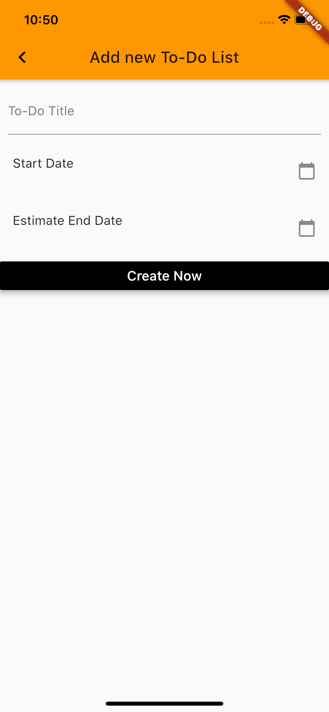

# etiqa_test_app

A new Flutter to-do list project.

## Getting Started

This project is a starting point for a Flutter application.

A few resources to get you started if this is your first Flutter project:

- [Lab: Write your first Flutter app](https://flutter.dev/docs/get-started/codelab)
- [Cookbook: Useful Flutter samples](https://flutter.dev/docs/cookbook)

For help getting started with Flutter, view our
[online documentation](https://flutter.dev/docs), which offers tutorials,
samples, guidance on mobile development, and a full API reference.

# iOS Screenshots of To-Do List Application

    

## Features
* Create New Tasks from the Action button.
* Able to add Date to the to-do list.
* Intergrated with sqlite dabatase which we can store to-do list locally.
* Edit/Update and Delete feature from the local sqlite db file.